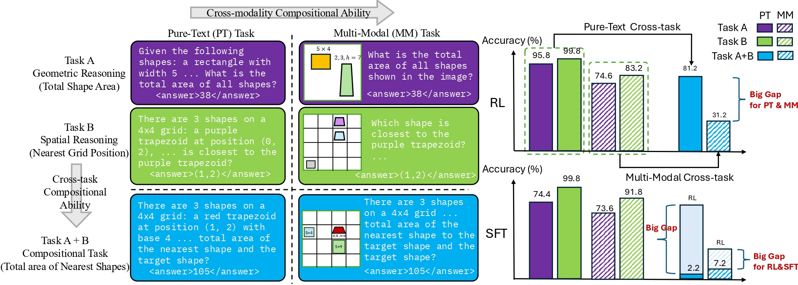

# Unveiling the Compositional Ability Gap in Vision-Language Reasoning Model

 

## 💡 Motivation

- **Can reasoning abilities learned through pure-text training be composed with visual perception to solve multimodal reasoning tasks?**

- **Can independently acquired visual reasoning skills be integrated to solve tasks that require multiple abilities?**
  
- **Can such compositional capabilities generalize to out-of-distribution (OOD) task variants with altered objectives?** 

## 📜 Key Observations
- **RL-trained models consistently outperform SFT in compositional settings, particularly for cross-task generalization;**
- **despite high performance on individual tasks, VLMs struggle with compositional reasoning when grounded in multimodal inputs;**
- **explicitly structuring the reasoning process—by prompting visual description before reasoning (caption-before-thinking) and incorporating intermediate progress rewards leads to significant improvements in compositional performance.**

## 🤗 ComPA Benchmark
- **[Pure-Text Geometric Reasoning(PT-GR) & Pure-Text Spatial Reasoning(PT-SR)](https://huggingface.co/datasets/tianleliphoebe/mm_r1_combined_easy_puretext)**
- **[Multi-Modal Geometric Reasoning(MM-GR) & Multi-Modal Spatial Reasoning(MM-SR)](https://huggingface.co/datasets/tianleliphoebe/mm_r1_combined_easy_modify)**

## 🎯 Task Setup Summary

| **Task Type**                          | **Training Subset**              | **Test Subset**                                          |
|----------------------------------------|----------------------------------|----------------------------------------------------------|
| Cross-Modal Composition                | PT-GR, PT-SR                     | PT-GR, PT-SR, MM-GR, MM-SR                               |
| Cross-Task Composition (Pure-text)     | PT-GR, PT-SR                     | PT-GR, PT-SR, PT-Comp                                    |
| Cross-Task Composition (Multimodal)    | MM-GR, MM-SR                     | MM-GR, MM-SR, MM-Comp                                    |
| OOD Composition                        | MM-GR, MM-SR                     | MM-GR-OOD, MM-SR-OOD, MM-Comp-OOD                        |

## Setup

```bash
conda create -n compa python=3.11 
conda activate compa

bash setup.sh
```

## Training

### RL-ground for shape area and grid position task

```bash
bash src/scripts/run_shape_spatial_rl_ground.sh

```

### RL

```bash
bash src/scripts/run_shape_spatial_rl.sh
```

### SFT

```bash
bash src/scripts/run_shape_spatial_sft.sh
```

## Evaluation


```bash
bash src/scripts/test_grpo_mm_multigpu.sh
```

